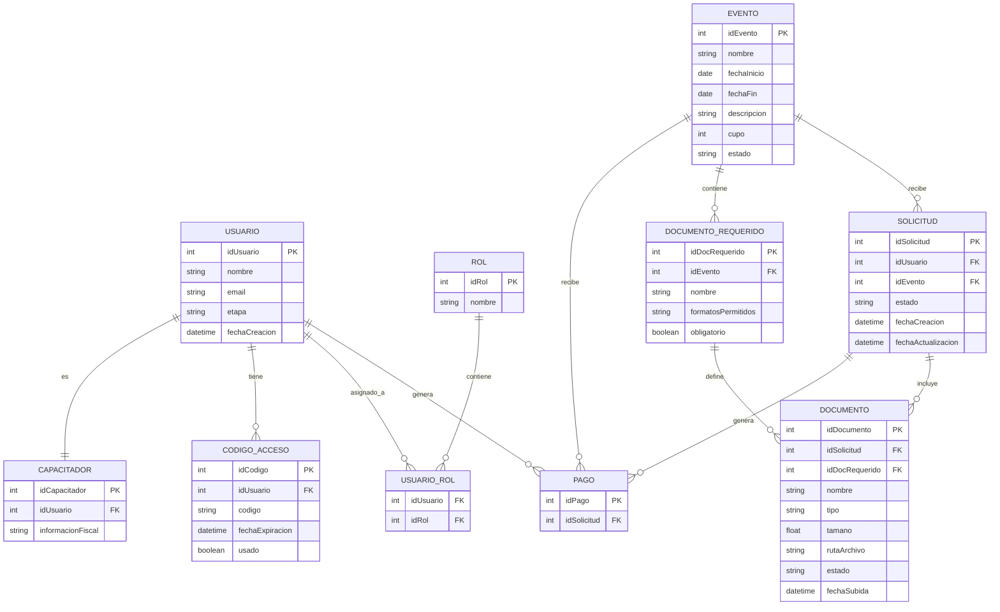

```mermaid
erDiagram
    USUARIO {
        int idUsuario PK
        string nombre
        string email
        string etapa
        datetime fechaCreacion
    }

    ROL {
        int idRol PK
        string nombre
    }

    USUARIO_ROL {
        int idUsuario FK
        int idRol FK
    }

    CODIGO_ACCESO {
        int idCodigo PK
        int idUsuario FK
        string codigo
        datetime fechaExpiracion
        boolean usado
    }

    EVENTO {
        int idEvento PK
        string nombre
        date fechaInicio
        date fechaFin
        string descripcion
        int cupo
        string estado
    }

    DOCUMENTO_REQUERIDO {
        int idDocRequerido PK
        int idEvento FK
        string nombre
        string formatosPermitidos
        boolean obligatorio
    }

    SOLICITUD {
        int idSolicitud PK
        int idUsuario FK
        int idEvento FK
        string estado
        datetime fechaCreacion
        datetime fechaActualizacion
    }

    DOCUMENTO {
        int idDocumento PK
        int idSolicitud FK
        int idDocRequerido FK
        string nombre
        string tipo
        float tamano
        string rutaArchivo
        string estado
        datetime fechaSubida
    }

    PAGO {
        int idPago PK
        int idSolicitud FK
    }

    CAPACITADOR {
        int idCapacitador PK
        int idUsuario FK
        string informacionFiscal
    }

    USUARIO ||--o{ PAGO : genera
    EVENTO ||--o{ SOLICITUD : recibe
    USUARIO ||--o{ USUARIO_ROL : asignado_a
    ROL ||--o{ USUARIO_ROL : contiene
    USUARIO ||--o{ CODIGO_ACCESO : tiene
    EVENTO ||--o{ DOCUMENTO_REQUERIDO : contiene
    DOCUMENTO_REQUERIDO ||--o{ DOCUMENTO : define
    SOLICITUD ||--o{ DOCUMENTO : incluye
    SOLICITUD ||--o{ PAGO : genera
    EVENTO ||--o{ PAGO : recibe
    USUARIO ||--|| CAPACITADOR : es
```
