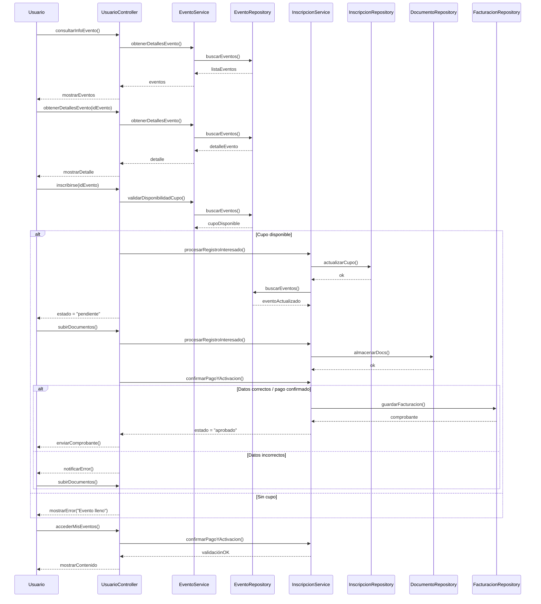

```mermaid
sequenceDiagram
    participant U as Usuario
    participant UC as UsuarioController
    participant ES as EventoService
    participant ER as EventoRepository
    participant IS as InscripcionService
    participant IR as InscripcionRepository
    participant DR as DocumentoRepository
    participant FR as FacturacionRepository
    %% ======================
    %% CONSULTA DE EVENTOS
    %% ======================
    U->>UC: consultarInfoEvento()
    UC->>ES: obtenerDetallesEvento()
    ES->>ER: buscarEventos()
    ER-->>ES: listaEventos
    ES-->>UC: eventos
    UC-->>U: mostrarEventos
    %% ==========================
    %% VER DETALLE + VALIDAR CUPO
    %% ==========================
    U->>UC: obtenerDetallesEvento(idEvento)
    UC->>ES: obtenerDetallesEvento()
    ES->>ER: buscarEventos()
    ER-->>ES: detalleEvento
    ES-->>UC: detalle
    UC-->>U: mostrarDetalle
    U->>UC: inscribirse(idEvento)
    UC->>ES: validarDisponibilidadCupo()
    ES->>ER: buscarEventos()
    ER-->>ES: cupoDisponible
    alt Cupo disponible
        UC->>IS: procesarRegistroInteresado()
        IS->>IR: actualizarCupo()
        IR-->>IS: ok
        IS->>ER: buscarEventos()
        ER-->>IS: eventoActualizado
        UC-->>U: estado = "pendiente"
        %% ======================
        %% SUBIR DOCUMENTOS
        %% ======================
        U->>UC: subirDocumentos()
        UC->>IS: procesarRegistroInteresado()
        IS->>DR: almacenarDocs()
        DR-->>IS: ok
        %% ======================
        %% VALIDACIÓN Y APROBACIÓN
        %% ======================
        UC->>IS: confirmarPagoYActivacion()
        alt Datos correctos / pago confirmado
            IS->>FR: guardarFacturacion()
            FR-->>IS: comprobante
            IS-->>UC: estado = "aprobado"
            UC-->>U: enviarComprobante()
        else Datos incorrectos
            UC-->>U: notificarError()
            U->>UC: subirDocumentos()
        end
    else Sin cupo
        UC-->>U: mostrarError("Evento lleno")
    end
    %% ======================
    %% ACCESO A CONTENIDO
    %% ======================
    U->>UC: accederMisEventos()
    UC->>IS: confirmarPagoYActivacion()
    IS-->>UC: validaciónOK
    UC-->>U: mostrarContenido
```
