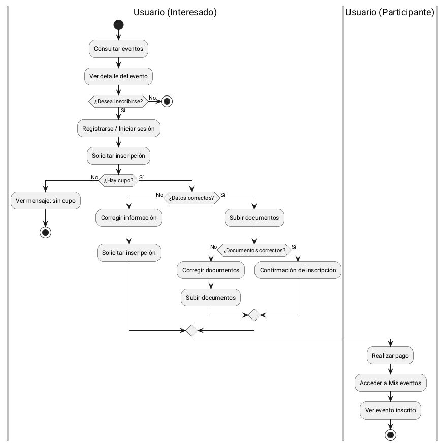
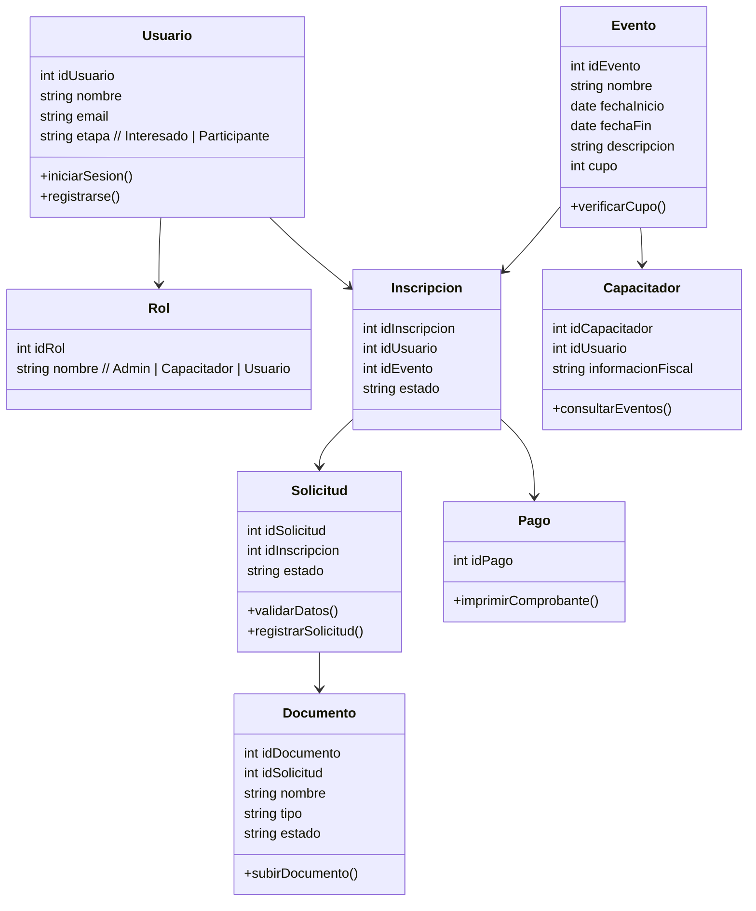

# Introducción  
# Objetivo
--- 
# Flujo de trabajo
- Archivos de flujo  
- Bitácoras  
- Problemática  
- Requisitos  
  - Funcionales  
  - No funcionales  
- Atributos del Sistema  
  - Actividades  
  - Secuencias  
  - Clases  
  - Arquitectura  
  - Base de datos  
  - Explicación del trabajo / metodología / reuniones / bitácoras  
--- 
# Problemática  
## Requisitos  
Los requisitos es una fase crucial en el desarrollo de software, se identifican las necesidades del cliente, que el sistema se construya correctamente y cumpla con los objetivos previstos.

Requisitos funcionales: Defina qué debe hacer el sistema (características y operaciones).

Requisitos no funcionales: Definan cómo debe funcionar el sistema (calidad, rendimiento y limitaciones).

### [Funcionales](https://github.com/Killercrod/SoftwareDesign/blob/5f38c6001150f0166b31610001c71d2e6fccf7c6/Analisis/Requerimientos/Funcionales/Desglose%20de%20Issues%20(RF).md)
Los requisitos funcionales especifica comportamientos observables y procesos a llevar a cabo que debe proveer el software.
Cada requerimiento es interpretable de una sola manera y testeables, es decir, debe con su cumplimiento en el programa.

RF-01 (Gestión de Perfil)

RF-02 (Solicitud de Inscripción)

RF-03 (Carga de Documentación)

RF-04 (Consulta de Estatus)

RF-05 (Reenvío de Solicitudes)

RF-06 (Acceso a Contenido)

### [Casos de Uso](https://github.com/Killercrod/SoftwareDesign/blob/5f38c6001150f0166b31610001c71d2e6fccf7c6/Analisis/Requerimientos/Funcionales/RF_CasosDeUso.md)
Un caso de uso explica cómo los usuarios interactúan con un producto o sistema. Describe el flujo de entradas del usuario estableciendo caminos exitosos y fallidos para alcanzar los objetivos. Esto permite a los equipos de producto comprender mejor qué hace un sistema, cómo funciona y por qué ocurren los errores.

CU-001: Iniciar Sesión y Gestionar Datos Actores: Usuario Descripción: El usuario deberá registrarse con su correo y contraseña además de poder entrar a la configuración de su perfil, ver y gestionar sus datos personales.

CU-02: Seleccionar Evento y Enviar Solicitud de Inscripción. Actores: Usuario Descripción: El usuario podrá navegar entre los distintos eventos que oferta la plataforma, revisar detalles sobre los eventos de su interés y enviar una solicitud de inscripción al evento seleccionado.

CU-03: Carga de Documentación.

CU-04: Consultar Estatus de Solicitudes.

CU-05: Reenviar Solicitud Actores.

CU-06: Acceder a Contenido de Eventos Actores.

### No funcionales  
  - Refinamiento y Desglose  
  - Atributos de calidad del sistema  
## Atributos del sistema   
### Flujo de Actividades [Diagrama de Actividades]

### Flujo de Secuencias [Diagramas de Secuencias]
 
### Flujo de Clases [Diagrama de clases]  

### Componentes y Dependencias (RNF.md)  
### Arquitectura  
  - Diagrama de Arquitectura  
  - Diagrama de despliegue
### Base de Datos  
