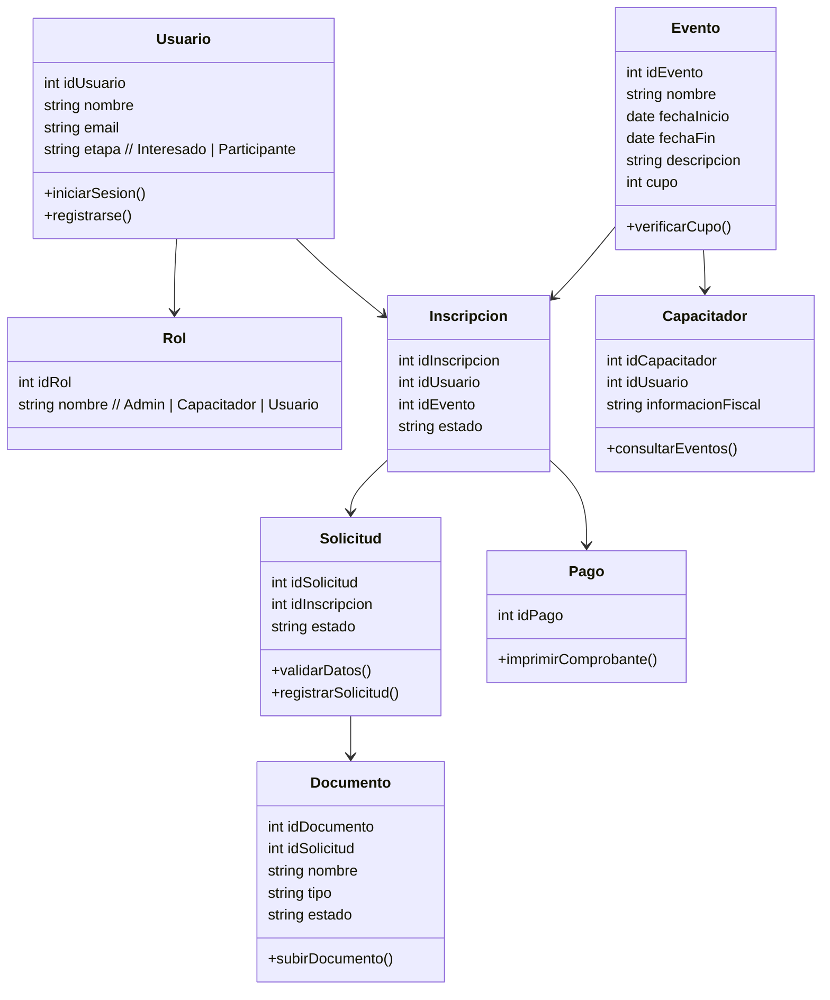

# Introducción  
# Objetivo
--- 
# Flujo de trabajo
- Archivos de flujo  
- Bitácoras  
- Problemática  
- Requisitos  
  - Funcionales  
  - No funcionales  
- Atributos del Sistema  
  - Actividades  
  - Secuencias  
  - Clases  
  - Arquitectura  
  - Base de datos  
  - Explicación del trabajo / metodología / reuniones / bitácoras  
--- 
# Problemática  
## Requisitos  
### Funcionales  
  - Casos de Uso [DiagramaCU]  
### No funcionales  
  - Refinamiento y Desglose  
  - Atributos de calidad del sistema  
## Atributos del sistema   
### Flujo de Actividades [Diagrama de Actividades]

### Flujo de Secuencias [Diagramas de Secuencias]
secuencias lo abarca
### Interesados [Diagrama Inscripción]  
secuencias lo abarca
### Participantes [Diagrama "Mis Eventos"]  
### Flujo de Clases [Diagrama de clases]  

### Componentes y Dependencias (RNF.md)  
### Arquitectura  
  - Diagrama de Arquitectura  
  - Diagrama de despliegue
### Base de Datos  
