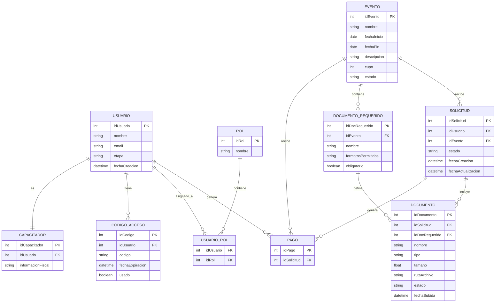
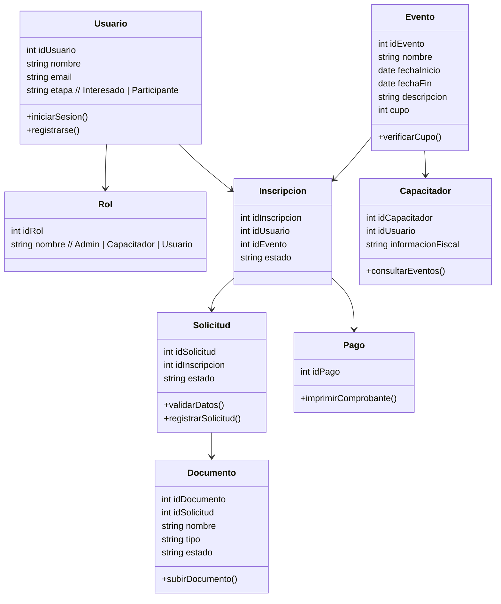

# Introducción

El presente proyecto consiste en el desarrollo de un sistema integral de gestión académica y comercial, orientado a optimizar la administración de eventos educativos, así como la captación y gestión de leads. La plataforma centraliza en un solo entorno la gestión de capacitaciones, cursos y diplomados, permitiendo una mejor organización de los procesos y una mayor eficiencia operativa.

El sistema se estructura en tres módulos principales: gestión de eventos, gestión de usuarios y gestión de ventas. A través de estos, se facilita la creación y administración de programas académicos, el manejo de capacitadores y participantes, y la automatización de la captación de prospectos desde fuentes externas como plataformas publicitarias y bolsas de trabajo.

Asimismo, la solución cubre todo el ciclo de vida del usuario, desde su registro inicial como interesado, pasando por el proceso de inscripción con validación de documentos y pagos, hasta su participación en los eventos y la generación de constancias. De esta manera, se proporciona una herramienta completa que integra tanto los aspectos académicos como comerciales de la institución.

#  Objetivo

Diseñar e implementar un sistema integral que permita gestionar de manera eficiente los eventos educativos, los usuarios y la captación de leads, automatizando los procesos de inscripción, validación y seguimiento, con el fin de mejorar la organización operativa, optimizar la conversión de prospectos y brindar una experiencia completa al usuario durante todo su ciclo de participación.

--- 
# Flujo de trabajo
- Archivos de flujo  
- Bitácoras  
- Problemática  
- Requisitos  
  - Funcionales  
  - No funcionales  
- Atributos del Sistema  
  - Actividades  
  - Secuencias  
  - Clases  
  - Arquitectura  
  - Base de datos  
  - Explicación del trabajo / metodología / reuniones / bitácoras  
--- 
# Problemática  
## Requisitos  
Los requisitos es una fase crucial en el desarrollo de software, se identifican las necesidades del cliente, que el sistema se construya correctamente y cumpla con los objetivos previstos.

Requisitos funcionales: Defina qué debe hacer el sistema (características y operaciones).

Requisitos no funcionales: Definan cómo debe funcionar el sistema (calidad, rendimiento y limitaciones).

### [Funcionales](https://github.com/Killercrod/SoftwareDesign/blob/5f38c6001150f0166b31610001c71d2e6fccf7c6/Analisis/Requerimientos/Funcionales/Desglose%20de%20Issues%20(RF).md)
Los requisitos funcionales especifica comportamientos observables y procesos a llevar a cabo que debe proveer el software.
Cada requerimiento es interpretable de una sola manera y testeables, es decir, debe con su cumplimiento en el programa.

RF-01 (Gestión de Perfil)

RF-02 (Solicitud de Inscripción)

RF-03 (Carga de Documentación)

RF-04 (Consulta de Estatus)

RF-05 (Reenvío de Solicitudes)

RF-06 (Acceso a Contenido)

### [Casos de Uso](https://github.com/Killercrod/SoftwareDesign/blob/5f38c6001150f0166b31610001c71d2e6fccf7c6/Analisis/Requerimientos/Funcionales/RF_CasosDeUso.md)
Un caso de uso explica cómo los usuarios interactúan con un producto o sistema. Describe el flujo de entradas del usuario estableciendo caminos exitosos y fallidos para alcanzar los objetivos. Esto permite a los equipos de producto comprender mejor qué hace un sistema, cómo funciona y por qué ocurren los errores.

CU-01: Iniciar Sesión y Gestionar Datos Actores: Usuario Descripción: El usuario deberá registrarse con su correo y contraseña además de poder entrar a la configuración de su perfil, ver y gestionar sus datos personales. Pre-Condiciones: El usuario ya debe tener una cuenta creada.

CU-02: Seleccionar Evento y Enviar Solicitud de Inscripción. Actores: Usuario Descripción: El usuario podrá navegar entre los distintos eventos que oferta la plataforma, revisar detalles sobre los eventos de su interés y enviar una solicitud de inscripción al evento seleccionado. Pre-Condiciones: El usuario debe haberse registrado en el sistema con su correo y contraseña para acceder a la plataforma. 

CU-03: Carga de Documentación. Actores: Usuario. Pre-Condiciones: El usuario debe haberse inscrito al evento de su interés.

CU-04: Consultar Estatus de Solicitudes. Actores: Usuario Descripción: El usuario podrá visualizar una lista de sus solicitudes que incluya en ella: su estado actual, detalles descriptivos de cada una, documentos y estado de pago Pre-Condiciones: El usuario debe haber iniciado sesión y contar con al menos una solicitud registrada.

CU-05: Reenviar Solicitud. Actores: Usuario Descripción: El usuario podrá editar una solicitud previamente rechazada o incompleta y reenviarla para su validación. Pre-Condiciones: El usuario debe haber iniciado sesión y contar con una solicitud en estado "rechazada" o "información incompleta".

CU-06: Acceder a Contenido de Eventos Actores. Actores: Usuario Descripción: El usuario podrá acceder a los eventos en los que ha sido aprobado, visualizando sus detalles y recursos disponibles. Pre-Condiciones: El usuario debe haber iniciado sesión y contar con una solicitud aprobada para al menos un evento.

### No funcionales  
  - Refinamiento y Desglose  
  - Atributos de calidad del sistema  
## Atributos del sistema   
### Diagrama Entidad-Relacion

## Diagrama Entidad-Relación

El diagrama representa la estructura de datos del sistema de gestión de eventos y capacitaciones. Se compone de 11 entidades relacionadas entre sí.

### Entidades centrales y su función

`USUARIO` es el núcleo del sistema, se conecta con casi todo. Un usuario puede tener múltiples solicitudes, códigos de acceso y un rol asignado. `EVENTO` es la otra entidad central, ya que agrupa las solicitudes, los documentos requeridos, los recursos y los capacitadores. `SOLICITUD` actúa como puente entre un usuario y un evento, y de ella se desprenden los documentos cargados y el pago. `CAPACITADOR` extiende a `USUARIO`, es decir, todo capacitador es también un usuario del sistema pero con información fiscal adicional y eventos asignados.

Las entidades de soporte son `CODIGO_ACCESO` para la autenticación por correo, `DOCUMENTO_REQUERIDO` para definir qué documentos exige cada evento, `DOCUMENTO` para los archivos que sube el usuario, `PAGO` para el estado financiero de cada solicitud, `RECURSO` para los materiales del evento y `USUARIO_ROL` como tabla intermedia que gestiona los roles.

### Claves PK y FK

Cada entidad tiene un campo marcado como `PK` — por ejemplo `idUsuario`, `idEvento`, `idSolicitud` — que identifica de forma única cada registro. Los campos marcados como `FK` son los que crean las conexiones, por ejemplo `SOLICITUD` tiene `idUsuario FK` e `idEvento FK`, lo que significa que cada solicitud sabe exactamente a qué usuario pertenece y a qué evento apunta, sin duplicar su información sino referenciándola. La tabla `USUARIO_ROL` es un caso especial donde ambos campos son FK, porque su único propósito es vincular usuarios con roles sin datos propios.

### Flujo de Actividades [Diagrama de Actividades]

### Flujo de Secuencias [Diagramas de Secuencias]
 
### Flujo de Clases [Diagrama de clases]  

### Explicación del modelo de clases
Este sistema está diseñado para gestionar eventos de capacitación, permitiendo la inscripción de usuarios, la validación de requisitos, la asignación de capacitadores y el registro de pagos.
A continuación se explica cada clase y su función dentro del sistema.

- **Usuario**  :
La clase Usuario representa a las personas que interactúan con el sistema.
Contiene información básica como el identificador, nombre y correo electrónico. También incluye un atributo que indica la etapa del usuario, la cual puede ser interesado o participante.
Esta clase permite realizar acciones como iniciar sesión y registrarse en el sistema.

- **Rol** : 
La clase Rol define el tipo de acceso que tiene un usuario dentro del sistema.
Permite clasificar a los usuarios en tres categorías principales: administrador, capacitador y usuario. Esto permite controlar los permisos y funcionalidades disponibles para cada tipo de usuario.

- **Evento** : 
La clase Evento representa las capacitaciones disponibles en el sistema.
Contiene información como el nombre del evento, fechas, descripción y el cupo máximo de participantes. Incluye una funcionalidad para verificar la disponibilidad de cupo antes de permitir nuevas inscripciones.

- **Inscripción** : 
La clase Inscripción es la entidad que relaciona a un usuario con un evento.
Representa el proceso de registro del usuario en un evento específico y almacena el estado de la inscripción, como pendiente, aprobada o rechazada.

- **Solicitud** : 
La clase Solicitud representa la validación del proceso de inscripción.
Se utiliza para revisar los datos del usuario y gestionar la aprobación o rechazo de la inscripción. También permite registrar formalmente la solicitud.

- **Documento** : 
La clase Documento almacena los archivos que el usuario debe subir como parte del proceso de inscripción.
Incluye información como el tipo de documento, el nombre del archivo y su estado de validación.

- **Pago** : 
La clase Pago representa la transacción económica asociada a una inscripción.
Se encarga de registrar el pago realizado por el usuario y permite la generación del comprobante correspondiente.

- **Capacitador** : 
La clase Capacitador representa a la persona encargada de impartir los eventos.
Está vinculada a un usuario del sistema y contiene información adicional como datos fiscales. También permite consultar los eventos asignados.

Relaciones generales del sistema:
  - Un usuario tiene un rol asignado.
  - Un usuario puede tener múltiples inscripciones.
  - Un evento puede tener múltiples usuarios inscritos.
  - Cada inscripción genera una solicitud.
  - Una solicitud puede incluir documentos.
  - Una inscripción puede tener un pago asociado.
  - Un capacitador puede estar asignado a múltiples eventos.

Componentes y Dependencias (RNF.md)  [Pendiente linkear]

### Arquitectura  
  - Diagrama de Arquitectura  
  - Diagrama de despliegue
### Base de Datos  

