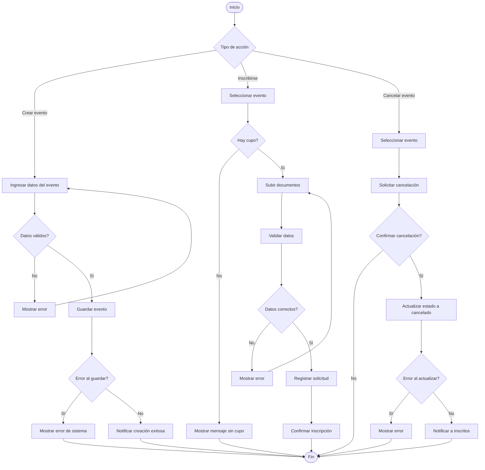

```mermaid
flowchart TD

A([Inicio]) --> B{Tipo de acción}

%% ===== CREAR EVENTO =====
B -->|Crear evento| C[Ingresar datos del evento]
C --> D{Datos válidos?}

D -- No --> E[Mostrar error]
E --> C

D -- Sí --> F[Guardar evento]
F --> G{Error al guardar?}

G -- Sí --> H[Mostrar error de sistema]
G -- No --> I[Notificar creación exitosa]
I --> Z([Fin])
H --> Z

%% ===== INSCRIPCIÓN =====
B -->|Inscribirse| J[Seleccionar evento]
J --> K{Hay cupo?}

K -- No --> L[Mostrar mensaje sin cupo]
L --> Z

K -- Sí --> M[Subir documentos]
M --> N[Validar datos]
N --> O{Datos correctos?}

O -- No --> P[Mostrar error]
P --> M

O -- Sí --> Q[Registrar solicitud]
Q --> R[Confirmar inscripción]
R --> Z

%% ===== CANCELACIÓN =====
B -->|Cancelar evento| S[Seleccionar evento]
S --> T[Solicitar cancelación]
T --> U{Confirmar cancelación?}

U -- No --> Z

U -- Sí --> V[Actualizar estado a cancelado]
V --> W{Error al actualizar?}

W -- Sí --> X[Mostrar error]
W -- No --> Y[Notificar a inscritos]

Y --> Z
X --> Z
```
