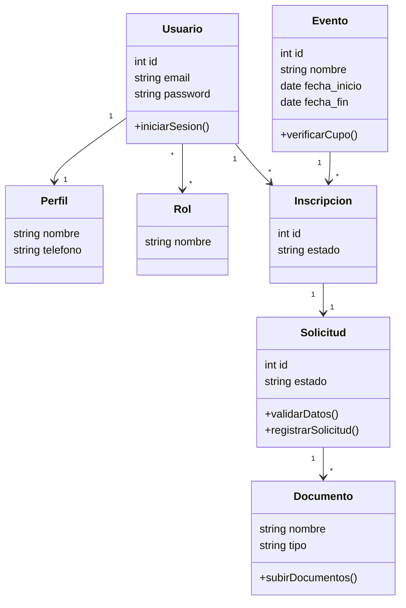

```mermaid
classDiagram

class Usuario {
  int id
  string email
  string password
  +iniciarSesion()
}

class Perfil {
  string nombre
  string telefono
}

class Rol {
  string nombre
}

class Evento {
  int id
  string nombre
  date fecha_inicio
  date fecha_fin
  +verificarCupo()
}

class Inscripcion {
  int id
  string estado
}

class Solicitud {
  int id
  string estado
  +validarDatos()
  +registrarSolicitud()
}

class Documento {
  string nombre
  string tipo
  +subirDocumentos()
}

Usuario "1" --> "1" Perfil
Usuario "*" --> "*" Rol
Usuario "1" --> "*" Inscripcion

Evento "1" --> "*" Inscripcion
Inscripcion "1" --> "1" Solicitud
Solicitud "1" --> "*" Documento
```
