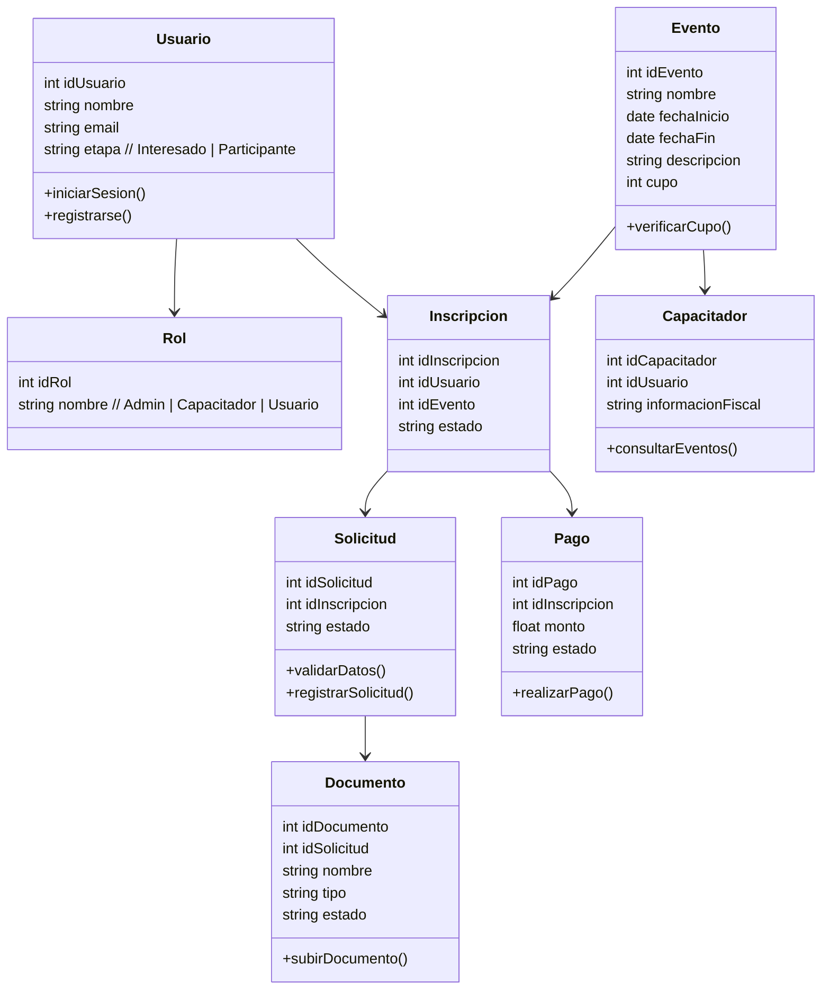

```mermaid
classDiagram

class Usuario {
  int idUsuario
  string nombre
  string email
  string etapa   // Interesado | Participante
  +iniciarSesion()
  +registrarse()
}

class Rol {
  int idRol
  string nombre  // Admin | Capacitador | Usuario
}

class Evento {
  int idEvento
  string nombre
  date fechaInicio
  date fechaFin
  string descripcion
  int cupo
  +verificarCupo()
}

class Inscripcion {
  int idInscripcion
  int idUsuario
  int idEvento
  string estado
}

class Solicitud {
  int idSolicitud
  int idInscripcion
  string estado
  +validarDatos()
  +registrarSolicitud()
}

class Documento {
  int idDocumento
  int idSolicitud
  string nombre
  string tipo
  string estado
  +subirDocumento()
}

class Pago {
  int idPago
  int idInscripcion
  float monto
  string estado
  +realizarPago()
}

class Capacitador {
  int idCapacitador
  int idUsuario
  string informacionFiscal
  +consultarEventos()
}

Usuario --> Rol
Usuario --> Inscripcion

Evento --> Inscripcion
Inscripcion --> Solicitud
Solicitud --> Documento
Inscripcion --> Pago

Evento --> Capacitador
```
